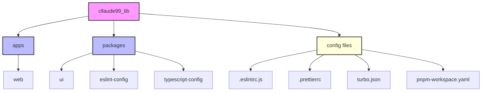

# cllaude99_lib

<div align="center">
    
    
    
    <br />
    
    
    
    <br />
    
    
    
    
</div>

## 프로젝트 소개

cllaude99_lib는 모던하고 확장 가능한 React 컴포넌트 라이브러리입니다. Turborepo를 기반으로 한 모노레포 구조를 채택하여 효율적인 개발 환경을 제공합니다.

### 주요 특징

- 🚀 **Turborepo 기반 모노레포**: 빠른 빌드 속도와 효율적인 패키지 관리
- 💅 **Emotion을 활용한 스타일링**: CSS-in-JS로 컴포넌트별 스타일 캡슐화
- 📱 **반응형 디자인**: 모바일 퍼스트 접근으로 다양한 디바이스 지원
- 📚 **Storybook 문서화**: 컴포넌트 문서화 및 시각적 테스트 환경 제공
- 🔍 **TypeScript**: 정적 타입 검사로 안정적인 개발 경험 제공

### 패키지 구조



### 패키지 설명

- **apps**

  - `web`: 컴포넌트 라이브러리 데모 및 문서화 웹사이트

- **packages**

  - `ui`: 핵심 UI 컴포넌트 라이브러리
  - `eslint-config`: 공유 ESLint 설정
  - `typescript-config`: 공유 TypeScript 설정

- **설정 파일**
  - `turbo.json`: Turborepo 파이프라인 설정
  - `pnpm-workspace.yaml`: 워크스페이스 설정
  - `.eslintrc.js`: ESLint 설정
  - `.prettierrc`: Prettier 설정

### 시작하기

```bash
# 패키지 설치
pnpm install

# 개발 서버 실행
pnpm dev

# 빌드
pnpm build

# 린트 실행
pnpm lint
```
